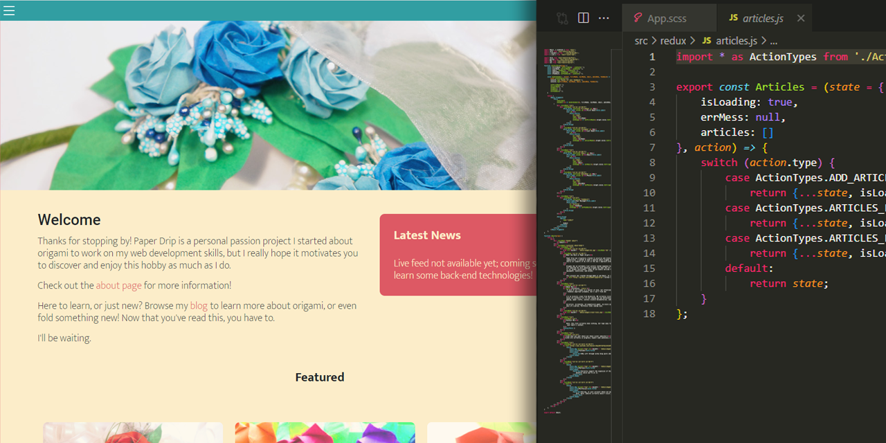

# Thanks for checking out Paper Drip 1.0!

This single-page app was a front end portfolio project dedicated to origami. This version is currently deprecated, and any issues it has will be resolved in 2.0, which includes a back end. If you haven't already, please do check it out! Here's a [link to Paper Drip 2.0](https://github.com/esh6597/paper-drip-full). It's updated to React 16.8+ with new hooks and Redux toolkit.

# About

### Come visit it!
I'm proud to finally announce that Paper Drip is live! You can [visit the website here](https://esh6597.github.io/paper-drip). As of right now there's no hash routing so be prepared for errors upon refreshing due to the code hijacking the URL. Since there's no official back end yet, I quickly deployed a [mock database via Heroku](https://paper-drip-json-server.herokuapp.com/) with JSON-server. Feel free to explore around! If you're interested, here's the [repository for the server](https://github.com/esh6597/paper-drip-json-server).

This webpage serves educational origami content and allows users to browse tags to search for the article or tutorial they need. It's a basic framework for a multi-purpose personal website meant to eventually foster a small community around paper crafts and host some of the other content I make.

This was a solo project, but I would deeply appreciate community suggestions! Thanks for taking the time to come see this app.

### Features

If you're interested, I've uploaded a [video overview of the site's functionality](https://youtu.be/VJM8nNDw8gA) that details how these are achieved. I'm currently working on polishing and cleaning this project up, so this video is slightly outdated for some of them.

Features included:

- Redux data structure--single application state
- Filter articles and store by tags
- Shopping cart with quantity options built in
- Terrible Sass organization
- Touch-enabled sidebar
- Dynamic view--scales to mobile and tablet
- Original images, designs and visual scheme

### Development Resources

Inside the /resources folder are various non-app files used for development, including:

- PSD file of graphics and icons used
- Adobe XD prototype of home and color scheme: no flows
- Site flowchart 1: an older, confusing map of the data
- Site flowchart 2: a simplified structural overview
- Sample JSON dev server with image files and db.json

Please understand that several changes were made to the overall site structure and data flow as development went on. This was my first time using [diagrams.net](https://www.diagrams.net/) for flowcharts and Adobe XD for a prototype, and these materials will be built upon in 2.0.

### Dependencies

This app is built with JavaScript that transpiles to HTML, but specifically utilizes the following frameworks and libraries:

- Yarn package manager (slightly less error prone + faster DL speeds)
- Sass and CSS for styling
- Bootstrap for dynamic containers
- Webpack and Babel for pre-processing
- React and Redux for UI, application state and data management
- Web Vitals, Redux-Logger, and JSON server: testing and error logging

# Usage

This project was scaffolded with *npx-create-react-app* and uses react-scripts to launch its development server.

#### Basic Commands
- Type *json-server --watch db.json --port 3443* in a bash terminal in the /test-server folder to start a server at 3443, the port the app uses for server connection. This *must* be running for the app to display properly.
- *yarn start* in bash to start development server at port 3001
- *yarn build* to build a production folder

#### Editing Styles
- __Do not edit .css files directly;__ they're all automatically generated from .scss files and will be overwritten.
- *yarn sass* in a separate terminal to begin watching all .scss files and convert them upon change. This isn't necessary to run the test server, but style changes won't automatically update unless this is running.

# Licenses

All of the code in this project is available under the MIT license:

### MIT License

Copyright (c) 2021 Erin Shuang Han

Permission is hereby granted, free of charge, to any person obtaining a copy
of this software and associated documentation files (the "Software"), to deal
in the Software without restriction, including without limitation the rights
to use, copy, modify, merge, publish, distribute, sublicense, and/or sell
copies of the Software, and to permit persons to whom the Software is
furnished to do so, subject to the following conditions:

The above copyright notice and this permission notice shall be included in all
copies or substantial portions of the Software.

THE SOFTWARE IS PROVIDED "AS IS", WITHOUT WARRANTY OF ANY KIND, EXPRESS OR
IMPLIED, INCLUDING BUT NOT LIMITED TO THE WARRANTIES OF MERCHANTABILITY,
FITNESS FOR A PARTICULAR PURPOSE AND NONINFRINGEMENT. IN NO EVENT SHALL THE
AUTHORS OR COPYRIGHT HOLDERS BE LIABLE FOR ANY CLAIM, DAMAGES OR OTHER
LIABILITY, WHETHER IN AN ACTION OF CONTRACT, TORT OR OTHERWISE, ARISING FROM,
OUT OF OR IN CONNECTION WITH THE SOFTWARE OR THE USE OR OTHER DEALINGS IN THE
SOFTWARE.

Find out more at https://opensource.org/licenses/MIT

### Creative Commons License

This work is licensed under a Creative Commons 
Attribution-NonCommercial-ShareAlike 4.0 International License. This license
applies to, but is not limited to:

- The website design
- All visual media except logos
- Blog posts and shop descriptions

As long as you give appropriate credit, use the same license, and include
a description of what changes were made, you are free to copy, change or
redistribute this material in any format for non-commercial purposes.

Find out more at https://creativecommons.org/licenses/by-nc-sa/4.0/